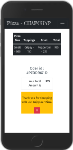

# pizza-chapchap

## Project Description
A model fullstack web application that simulates activities of an order for pick-up or delivery pizza business.
Users will be able to :~
* Select the size of pizza e.g Small, Medium, Large.
* Select crust of their liking e.g Crispy, Stuffed, Gluten-free, also toppings.
* Option to order as many pizzas in a single process.
* Option to select delivery or pick-up.
* Check total bill charge for order confirmation.

## Installation and Set-up
Here is a run through of how to set up the application
* Step 1 : Clone this repository using **`git clone https://github.com/jumaBrian/pizza-chapchap.git**, or downloading a ZIP file of the code.
* Step 2 : The repository, if downloaded as a .zip file will need to be extracted to your preferred location and opened
* Step 3 : Open the index.html file to view the application on your preferred web browser
## Other Usage / Live link
* Get access to the Internet/Browser.
* Click on live link provided : https://jumabrian.github.io/pizza-chapchap/
## Built With
* BOOTSTRAP 5.
* Javascript.
* JQuery.
* CSS3.
* HTML5.
  

## Author
jumaBrian 

 
Contact me via Email: njengabrianj@gmail.com

## License 
The project is served under the MIT LICENSE copyright &copy; 2022 jumaBrian.
View <a href="https://github.com/jumaBrian/pizza-chapchap/blob/main/LICENSE">license.</a>
